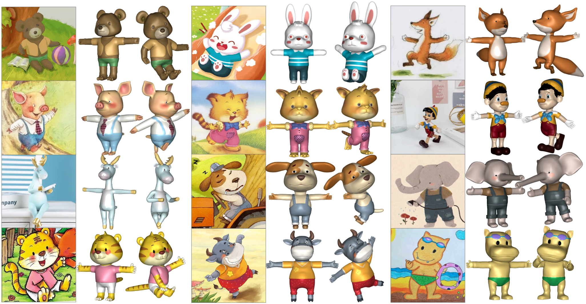

# RaBit & 3DBicar


By Zhongjin Luo*, Shengcai Cai*, Jinguo Dong, Ruibo Ming, Liangdong Qiu, [Xiaohang Zhang](https://xiaohangzhan.github.io/) and [Xiaoguang Han](https://gaplab.cuhk.edu.cn/)

| [Paper](https://arxiv.org/abs/2303.12564) | [Project](https://gaplab.cuhk.edu.cn/projects/RaBit/) | [Dataset](https://gaplab.cuhk.edu.cn/projects/RaBit/dataset.html) |

## Introduction

This repository is built for:

*RaBit:* Rarametric Modeling of 3D Biped Cartoon Characters with a Topological-consistent Dataset (CVPR2023)[[arXiv](https://arxiv.org/abs/2303.12564)]

If you find our work useful in your research, please consider citing:
```
@article{luo2023rabit,
  title={RaBit: Parametric Modeling of 3D Biped Cartoon Characters with a Topological-consistent Dataset},
  author={Luo, Zhongjin and Cai, Shengcai and Dong, Jinguo and Ming, Ruibo and Qiu, Liangdong and Zhan, Xiaohang and Han, Xiaoguang},
  journal={arXiv preprint arXiv:2303.12564},
  year={2023}
}
```

## Dataset



3DBiCar contains **1,500 topologically consistent**, **textured and skinned** 3D high-quality models with paired 2D images, which <u>covers 15 species and 4 image styles</u>.

you can visit our project page for more information.

## demo

we provide a numpy implementation with a GUI viewer, and a model_with_eyes inference implemented by torch.

### dependence

create virtural environment if you need. and then exe the command below in your terminal

```
pip3 install -r requirements.txt
```

#### PCA matrix

need download a <u>**pcamat.npy**</u> under the path of **"./rabit_data/rabit/"** , it's available [here](https://cuhko365-my.sharepoint.com/:f:/g/personal/221019019_link_cuhk_edu_cn/EgYr8ivgBRVNtOftTCi1CuMBW4heNDA9SeNfIa__Z6n4_Q)

and then execute


### numpy implementation

```shell
python rabit_np.py
```
will generate a **rabit_save.obj** file in the root of the project

GUI Viewer: thanks SMPL Viewer's owner, 
Our GUI viewer implemented on base of his work.

```shell
python3 app.py
```


### torch implementation

```shell
python rabit_torch.py
```
**rabit.obj** & **rabit_eyes** will be generate in the root path.


## Contact

If you have any questions, please contact Jinzhong luo (tjluozhongjin@gmail.com) or Shengcai Cai (221019019@link.cuhk.edu.cn).

## Credit

Thanks for the github repo owner, these projects are used in our jobs:

* https://github.com/thmoa/smpl_viewer
